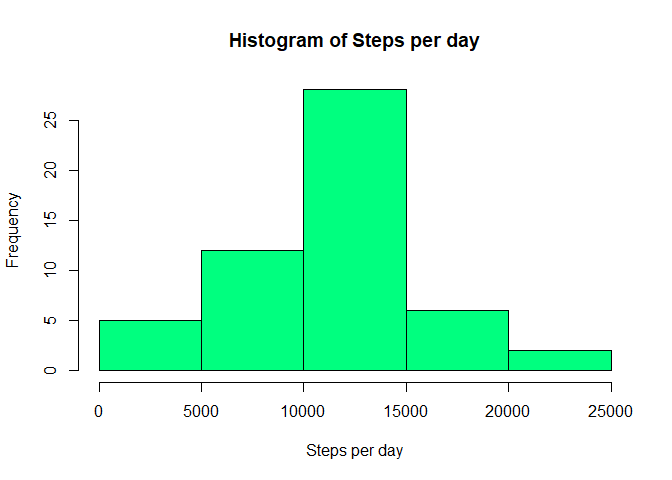
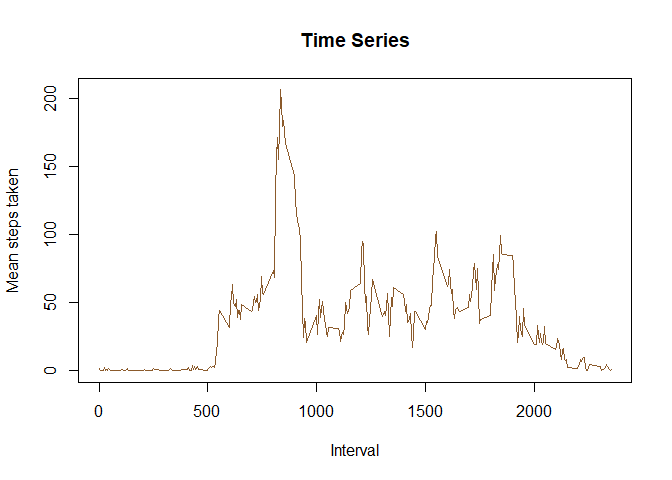
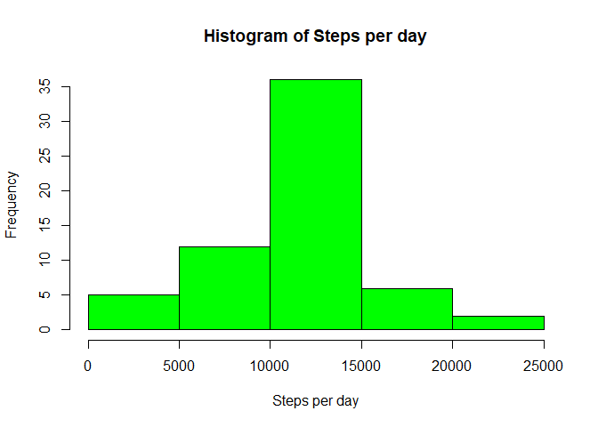
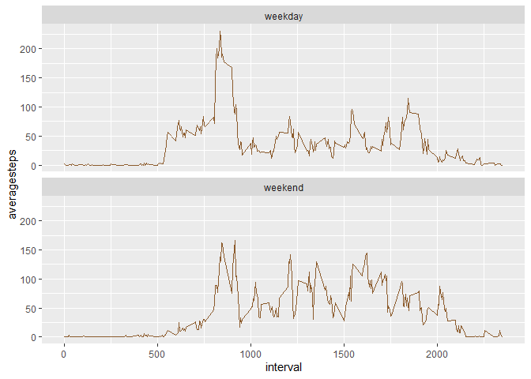

## Loading and preprocessing the data


```r
unzip("activity.zip")
activity_data<-read.csv("activity.csv")
activity_data$date<-as.Date(activity_data$date)
```

## What is mean total number of steps taken per day?


```r
steps_day<-aggregate(activity_data$steps~activity_data$date,activity_data,sum,na.rm=TRUE)
colnames(steps_day)<-c("date","TotalSteps")
head(steps_day)
```

```
##         date TotalSteps
## 1 2012-10-02        126
## 2 2012-10-03      11352
## 3 2012-10-04      12116
## 4 2012-10-05      13294
## 5 2012-10-06      15420
## 6 2012-10-07      11015
```

```r
hist(steps_day$TotalSteps,xlab = "Steps per day",main = "Histogram of Steps per day",col = "springgreen1")
```

<!-- -->

```r
mean1<-mean(steps_day$TotalSteps)
median1<-median(steps_day$TotalSteps)
print(mean1)
```

```
## [1] 10766.19
```

```r
print(median1)
```

```
## [1] 10765
```

## What is the average daily activity pattern?


```r
mean_steps<-tapply(activity_data$steps,activity_data$interval,mean,na.rm=TRUE)
mean_steps<-as.data.frame(mean_steps)
colnames(mean_steps)<-"AverageSteps"
mean_steps$Interval<-as.integer(rownames(mean_steps))
plot(x=mean_steps$Interval,y=mean_steps$AverageSteps,xlab ="Interval",ylab ="Mean steps taken",main = "Time Series",type = "l",col="tan4")
```

<!-- -->

```r
mean_steps[which.max(mean_steps$AverageSteps),]$Interval
```

```
## [1] 835
```

## Imputing missing values


```r
sum(is.na(activity_data))
```

```
## [1] 2304
```

We will be filling in the NA values for a interval by replacing it with the mean of the interval across all days.This is done by the following function getmissingvalues which takes an interval as an argument and returns the mean steps value which replaces the NA values in the old activity dataset.


```r
getmissingvalues<-function(interval)
{
  mean_steps[mean_steps$Interval==interval,1]
}
```


```r
activity_data_imputted<-activity_data
rows<-nrow(activity_data_imputted)
for(j in 1:rows)
{
  if(is.na(activity_data_imputted[j,"steps"]))
    activity_data_imputted[j,"steps"]<-getmissingvalues(activity_data_imputted[j,"interval"])
}
head(activity_data_imputted)
```

```
##       steps       date interval
## 1 1.7169811 2012-10-01        0
## 2 0.3396226 2012-10-01        5
## 3 0.1320755 2012-10-01       10
## 4 0.1509434 2012-10-01       15
## 5 0.0754717 2012-10-01       20
## 6 2.0943396 2012-10-01       25
```

```r
new_steps_day<-tapply(activity_data_imputted$steps,activity_data_imputted$date,sum,na.rm=TRUE)
new_steps_day<-as.data.frame(new_steps_day)
colnames(new_steps_day)<-"Steps"
new_steps_day$date<-rownames(new_steps_day)
hist(new_steps_day$Steps,xlab = "Steps per day",main = "Histogram of Steps per day",col = "green")
```

<!-- -->

```r
mean2<-mean(new_steps_day$Steps)
median2<-median(new_steps_day$Steps)
print(mean2)
```

```
## [1] 10766.19
```

```r
print(median2)
```

```
## [1] 10766.19
```
After replacing missing data,the mean has not noticed any noticeable change.
The median has changed by only 0.1%.

## Are there differences in activity patterns between weekdays and weekends?


```r
daytype<-character()
days<-c("Saturday","Sunday")
for(j in 1:rows)
{
  if(weekdays(activity_data_imputted[j,"date"]) %in% days)
     daytype[j]<-"weekend"
  else
    daytype[j]<-"weekday"
}
daytype<-as.factor(daytype)
activity_data_imputted$daytype<-daytype
head(activity_data_imputted)
```

```
##       steps       date interval daytype
## 1 1.7169811 2012-10-01        0 weekday
## 2 0.3396226 2012-10-01        5 weekday
## 3 0.1320755 2012-10-01       10 weekday
## 4 0.1509434 2012-10-01       15 weekday
## 5 0.0754717 2012-10-01       20 weekday
## 6 2.0943396 2012-10-01       25 weekday
```

```r
avg_steps_day<-aggregate(activity_data_imputted$steps~activity_data_imputted$interval + activity_data_imputted$daytype,activity_data_imputted,mean)
colnames(avg_steps_day)<-c("interval","daytype","averagesteps")
library(ggplot2)
obj<-ggplot(avg_steps_day,aes(x=interval,y=averagesteps))+ geom_line(color="tan4") + facet_wrap(~daytype,nrow=2)
print(obj)
```

<!-- -->
